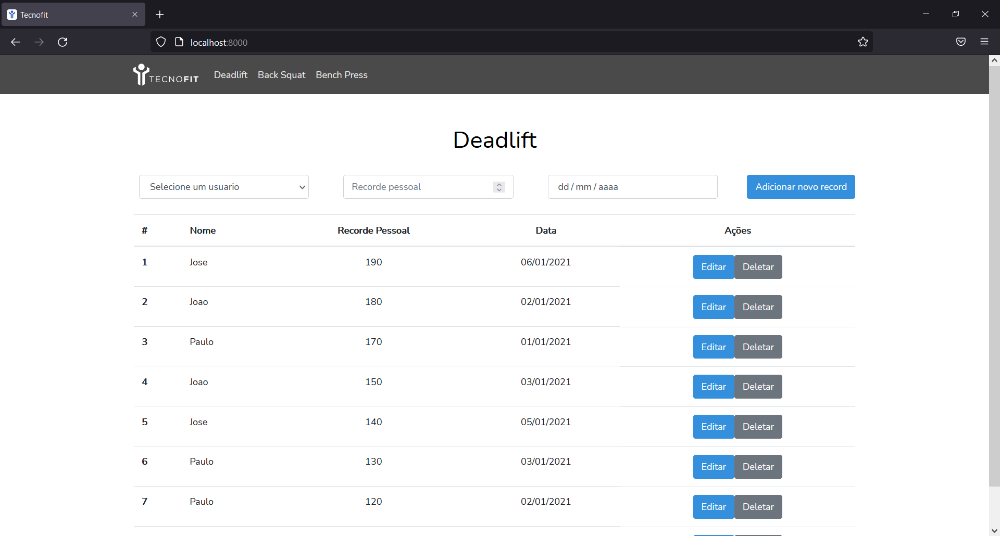
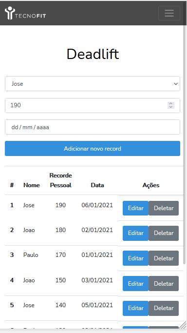

## Sobre o desenvolvimento

O projeto foi desenvolvido com base no framework Laravel, um framework PHP que facilita a construção de um projeto baseado em MVC (Model, View, Controller) que facilita na contrução de projetos de médio/grande porte.

Ademais este projeto foi escrito em PHP 8, Bootstrap 4.6, Jquery 3.5.1 e muito amor.

Construido de forma 100% responsiva, podendo ser usada em App via WebView ou do navegador de celulares e tablets.

## Sobre as funcionalidades

Neste projeto foi pedido que escrevesse um código com endpoint REST.

O Projeto faz um CRUD completo do focado no ranking, deixando para o banco apenas a parte de usuario e movimento à ser colocado diretamente.

Devido a framework este projeto é facilmente escalonavel e já está pronto para produção.

## Sobre como rodar

O projeto é construido em Laravel, e foi instalado via composer. À seguir uma lista de algumas coisas que precisam estar instaladas no projeto:

- Composer
- PHP
- XAMPP (ou equivalente para rodar MySQL Server)
- MySQL Workbench (ou equivalente para conectar ao MySQL Server)

Feito isso, precisamos ir até a raiz do projeto e rodar o banco.sql seu workbench, para que seja criado o esquema e tabelas que serão consumidas pelo projeto. A configuração de conexão ao banco, está configurado no arquivo .env, que está localizado na raiz do projeto.

Instalado tudo e com o banco pronto, apenas será preciso rodar dois códigos na raiz do projeto:
- composer install
- php artisan serve

Feito isso, o projeto irá rodar na URL http://localhost:8000/ , e já poderá ser testado o CRUD do projeto.

## Sobre as requisições
#### GET
###### Sem paramos, este get retorna todos os dados de rankeamento, incluindo nome e ID do usuario
- http://localhost:8000/deadlift/get
- http://localhost:8000/backsquat/get
- http://localhost:8000/benchpress/get

#### DELETE
##### Parametros
**Header:** X-CSRF-TOKEN = (token gerado pelo Laravel)
**Body:** record_id = (id do ranking)
- http://localhost:8000/deadlift/delete
- http://localhost:8000/backsquat/delete
- http://localhost:8000/benchpress/delete

#### UPDATE/CREATE
###### Para criar esta requisição, eu queria economizar tempo não utilizando ajax para fazer a requisição PUT (talvez uma escolha ruim), pois a tag form não recebe PUT como parametro de metodo. Para isso, utilizei a mesma requisição, diferenciada pelo parametro edit, que irá 0 para que seja uma requisição CREATE e 1 para que seja uma requisição UPDATE.

##### Parametros
**Header:** X-CSRF-TOKEN = (token gerado pelo Laravel)
**Body:** name = user->id, value = valor do record, date = data do record, record_id = (para o caso de uma requisição com edit = 1, é enviado o id do record), edit = (0 para uma requisição CREATE e 1 para requisição UPDATE)
- http://localhost:8000/deadlift/delete
- http://localhost:8000/backsquat/delete
- http://localhost:8000/benchpress/delete

## Imagens
# Desktop

# Requisição

# Mobile

## Licença
O projeto foi escrito inteiramente por mim, baseado em projetos que já fiz nesta framework e Stackoverflow.
